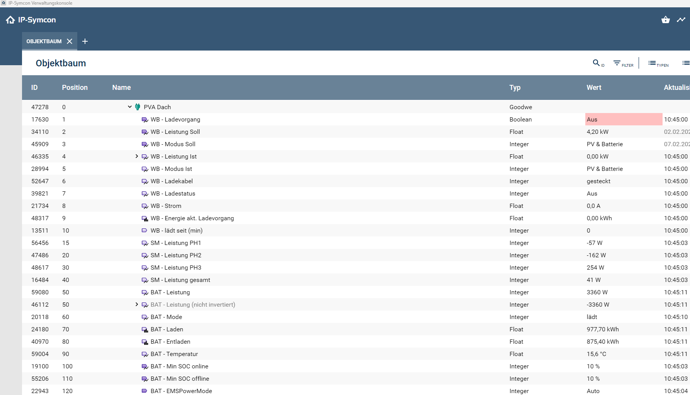

### Modul für Goodwe für IP-Symcon
Dieses Modul ermöglicht, Daten von einem Goodwe Wechselricher mit/ohne Batterie und/oder einer Goodwe Wallbox abzufragen. 

Unterstützt sind folgende Komponenten:
Goodwe Wechselrichter (ET Plus+ 10kW). Andere Goodwe-Wechselrichter (insbesondere alle der Serie ET, EH, BH, BT) dürften ebenfalls kompatibel sein, da diese gemäss Doku über dieselben Register angesprochen werden.
Goodwe Batterie (Lynx Home F Plus). Andere mit dem Wechslerichter kompatible Batterien dürften ebenfalls kompatibel sein, da diese über den Wechslerichter abgefragt werden.
Goodwe Wallbox der 1. Generation (HCA-Serie) wird über die SEMS-API unterstützt, da diese kein Modbus beherrscht. Die Wallbox der 2. Generation (HCA-Serie G2)ist angekündigt ca. Mai 2025 und beherrscht dann Modbus und Phasenumschaltung. Falls ich diese anschaffe wird diese dann ebenfalls unterstützt sein.

### Wichtig zu wissen zur Konfiguration des Moduls
Die Verbindung mit dem Goode Wechselrichter der ET-, EH-, BH-, oder BT-Serie  wird über Modbus hergestellt. Die Register können nach Wunsch aus einer Liste via Konfigurationsformular ausgewählt werden. Es sind nicht alle möglichen Register in der Auswahl vorhanden. Gerne erweitere ich aber die Auswahl bei Bedarf. 
Die Verbindung mit der Goodwe Wallbox GW11K-HCA (1. Generation) wird über die SEMS-API hergestellt. Dazu werden die Zugangsdaten des SEMS-Portal und die Seriennummer der Goodwe Wallbox benötigt. Diese kann in der SEMS-APP in der Wallboxsteuerung nachgesehen werden.
Während der Installation des Moduls wird automatisch ein Modbus-Gateway erstellt, sofern noch keines vorhanden ist. Besteht bereteits ein Gateway, kann dieses ausgewählt werden. Die Geräte-ID des Wechselrichters ist 247.
Danach kann die IP-Adresse des Wechselrichters in den Client Socket eingetragen werden. 
Der Port ist standardmässig 502, sofern der Wechselrichter über das LAN-Modul direkt abgefragt wird. 
Ansonsten den Port des Modbus-Adapters verwenden, welcher dann über RS485 mit dem Wechselrichter verbunden ist.

### Inhaltsverzeichnis

1. [Funktionsumfang](#1-funktionsumfang)
2. [Voraussetzungen](#2-voraussetzungen)
3. [Software-Installation](#3-software-installation)
4. [Einrichten der Instanzen in IP-Symcon](#4-einrichten-der-instanzen-in-ip-symcon)
5. [Statusvariablen und Profile](#5-statusvariablen-und-profile)
6. [WebFront](#6-webfront)
7. [PHP-Befehlsreferenz](#7-php-befehlsreferenz)
8. [Versionen](#8-versionen)

### 1. Funktionsumfang

* Abfrage und Ansteuerung ausgewählter Register des Wechselrichters, gruppiert nach Smartmeter (SM), Batterie (BAT)  und Wechselrichter (WR). Die Steuerung von SOC online/offline und EMS Power Mode ist möglich.
* Abfrage und Steuerung der Wallbox. Die Steuerung der Ladeleistung (für Schnellladung), des Modus (Schnell, PV-Priorität oder PV&Batterie) ist möglich.

### 2. Voraussetzungen

- IP-Symcon ab Version 7.0
- Goodwe Wechselrichter der ET-, EH-, BH-, oder BT-Serie mit/ohne Batterie und/oder eine Goodwe Wallbox GW11K-HCA.

### 3. Software-Installation

* Das Modul kann über den Modul-Store installiert werden.

### 4. Einrichten der Instanzen in IP-Symcon

- Unter 'Instanz hinzufügen' kann das 'Goodwe'-Modul mithilfe des Schnellfilters gefunden werden.  
- Weitere Informationen zum Hinzufügen von Instanzen in der [Dokumentation der Instanzen](https://www.symcon.de/service/dokumentation/konzepte/instanzen/#Instanz_hinzufügen)

__Konfigurationsseite__:

Name     | Beschreibung
-------- | ------------------
Selected Registers         |  Hier können die Register für die Modbus-Abfrage ausgewählt werden. Diese sind nach WR (Wechselrichter), BAT (Batterie) und SM (Smartmeter) gruppiert. Die Variablen werden automatisch erstellt oder gelöscht.
Intervall                  |  Intervall für die Abfrage der Modbus-Register. Standard ist 5 sek.
SEMS-API-Konfiguration     |  Die Konfiguration ist nur bei vorhandener Goodwe-Wallbox erforderlich, da sich diese nicht über Modbus abfragen lässt. Der Timer ist hier Standardmässig auf 30 sec eingestellt. Die Wallbox Variablen (WB) werden automatisch nach der Eingabe der Zugangsdaten erstellt bzw. gelöscht. Vorsicht, nicht zu häufig abfragen, sonst blockiert die API.
Werte lesen                |  Hiermit können alle aktvierten Datenpunkte abgefragt werden

### 5. Statusvariablen und Profile

Die Statusvariablen/Kategorien werden automatisch angelegt bzw. gelöscht, je nach Auswahl der Register im Konfigurationsformulars.

#### Steuervariablen

Aktuell sind folgende Ansteuerung möglich:

Wallbox:
- WB - Ladevorgang (Starten oder Stoppen des Ladevorganges)
- WB - Leistung Soll (Soll Leistung der Wallbox (4.2-11kW), nur relevant im Modus 'Schnell')
- WB - Modus Soll (Soll Modus der Wallbox (Schnell, PV-Rriorität, PV&Batterie))

Batterie/Wechselrichter:
- BAT - Min SOC online (Minimaler SOC der Batterie bei vorhandener Stromnetz-Verbindung)
- BAT - Min SOC offline (Minimaler SOC der Batterie bei nicht vorhandener Stromnetz-Verbindung)
- BAT - EMSPowerMode (Modus des EnergieManagentSystems in Zusammenhang mit der Batterie (wenn du weist was du tust, der Modus 'Auto' ist zu bevorzugen))
- BAT - EMSPowerSet (zugehörige Leistung bei Auswahl eines anderen EMSPowerMode als 'Auto' (max. 10000 Watt)).

#### Statusvariablen

Es werden Variablen je nach Wahl der Register erstellt. 
Bei Abwahl dieses Registers wird die Variable gelöscht.
Die Variablen der Wallbox werden nach der Eingabe der Zugangsdaten zur SEMS-API automatisch erstellt.
Beim löschen eines der Felder für die Zugangsdaten werden die die Variablen wieder gelöscht.

#### Profile

Name   | Typ
------ | ------- 
Goodwe.EMSPowerMode     |  Integer 
Goodwe.WB_State         |  Integer  
Goodwe.WB_Mode          |  Integer 
Goodwe.WB_Power_W       |  Integer 
Goodwe.Mode             |  Integer
Goodwe.WB_Workstate     |  Integer
Goodwe.Watt             |  Integer
Goodwe.Percent          |  Integer
Goodwe.WattEMS          |  Integer

### 6. WebFront

Alle Variablen mit Aktion können aus der Visualisierung heraus gesteuert werden.

### 7. PHP-Befehlsreferenz

Befehl   | Beschreibung
------ | -------
Goodwe_FetchAll(12345);         |   Alle Datenpunkte aktualisieren
Goodwe_FetchWallboxData(12345); |   Datenpunkte der Wallbox aktualisieren (Über SEMS-API)
Goodwe_FetchInverterData(12345);|   Datenpunkte des Wechselrichters akualisieren (Über Modbus)

### 8. Versionen

Version 2.1 (25.03.2025)
- Wallbox Soll- und Ist-Leistung wird nun in Watt angezeigt statt kW. Allenfalls müssen die beiden Variablen 'WB - Leistung Soll' und 'WB - Leistung ist' manuell gelöscht werden, sie werden dann automatisch wieder erstellt.

Version 2.0 (15.02.2025)
- Neues Variablenprofil für die Regelung von EMSPowerSet (Leistungsvorgabe) auf 10000 Watt beschränkt.
- EMSPowermode (Priorität der Energiequelle) auf alle möglichen Modis erweitert.
- Version um die Store-Kompatibilität zu erlangen.
- Doku angepasst
- Einige interne Anpassungen

Version 1.3 (25.01.2025)
- Register 35105 und 35109 war falsch konfiguriert und lieferte keinen Wert.

Version 1.2 (19.01.2025)
- Eigenes Variablenprofil für Prozent auf 1% abgestuft
- Interne Umbenennung einiger Funktionen und Timer
- Doku angepasst

Version 1.1 (14.01.2025)
- Steuerung von EMS-Power Mode (Netzladen der Batterie)
- Steuerung von SOC online/offline (maximale Entladung der Batterie)
- Fehlermeldung in Register Auswahlmenu behoben

Version 1.0 (12.01.2025)
- Initiale Version