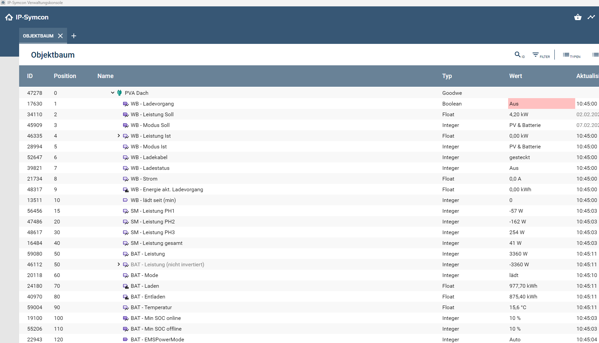

### Modul für Goodwe für IP-Symcon
Dieses Modul ermöglicht, Daten von einem Goodwe Wechselricher mit/ohne Batterie und/oder einer Goodwe Wallbox abzufragen. 

Unterstützt sind folgende Komponenten:
Goodwe Wechselrichter (ET Plus+ 10kW). Andere Goodwe-Wechselrichter (insbesondere alle der Serie ET, EH, BH, BT) dürften ebenfalls kompatibel sein, da diese gemäss Doku über dieselben Register angesprochen werden.
Goodwe Batterie (Lynx Home F Plus). Andere mit dem Wechslerichter kompatible Batterien dürften ebenfalls kompatibel sein, da diese über den Wechslerichter abgefragt werden.

### Wichtig zu wissen zur Konfiguration des Moduls
Die Verbindung mit dem Goode Wechselrichter der ET-, EH-, BH-, oder BT-Serie  wird über Modbus hergestellt. Die Register können nach Wunsch aus einer Liste via Konfigurationsformular ausgewählt werden. Es sind nicht alle möglichen Register in der Auswahl vorhanden. Gerne erweitere ich aber die Auswahl bei Bedarf. 
Während der Installation des Moduls wird automatisch ein Modbus-Gateway erstellt, sofern noch keines vorhanden ist. Besteht bereteits ein Gateway, kann dieses ausgewählt werden. Die Geräte-ID des Wechselrichters ist 247.
Danach kann die IP-Adresse des Wechselrichters in den Client Socket eingetragen werden. 
Der Port ist standardmässig 502, sofern der Wechselrichter über das LAN-Modul direkt abgefragt wird. 
Ansonsten den Port des Modbus-Adapters verwenden, welcher dann über RS485 mit dem Wechselrichter verbunden ist.

### Inhaltsverzeichnis

1. [Funktionsumfang](#1-funktionsumfang)
2. [Voraussetzungen](#2-voraussetzungen)
3. [Software-Installation](#3-software-installation)
4. [Einrichten der Instanzen in IP-Symcon](#4-einrichten-der-instanzen-in-ip-symcon)
5. [Statusvariablen und Profile](#5-statusvariablen-und-profile)
6. [WebFront](#6-webfront)
7. [PHP-Befehlsreferenz](#7-php-befehlsreferenz)
8. [Versionen](#8-versionen)

### 1. Funktionsumfang

* Abfrage und Ansteuerung ausgewählter Register des Wechselrichters, gruppiert nach Smartmeter (SM), Batterie (BAT)  und Wechselrichter (WR). Die Steuerung von SOC online/offline und EMS Power Mode ist möglich.

### 2. Voraussetzungen

- IP-Symcon ab Version 8.1
- Goodwe Wechselrichter der ET-, EH-, BH-, oder BT-Serie mit/ohne Batterie und/oder eine Goodwe Wallbox GW11K-HCA.

### 3. Software-Installation

* Das Modul kann über den Modul-Store installiert werden.

### 4. Einrichten der Instanzen in IP-Symcon

- Unter 'Instanz hinzufügen' kann das 'Goodwe'-Modul mithilfe des Schnellfilters gefunden werden.  
- Weitere Informationen zum Hinzufügen von Instanzen in der [Dokumentation der Instanzen](https://www.symcon.de/service/dokumentation/konzepte/instanzen/#Instanz_hinzufügen)

__Konfigurationsseite__:

Name     | Beschreibung
-------- | ------------------
Selected Registers         |  Hier können die Register für die Modbus-Abfrage ausgewählt werden. Diese sind nach WR (Wechselrichter), BAT (Batterie) und SM (Smartmeter) gruppiert. Die Variablen werden automatisch erstellt oder gelöscht.
Intervall                  |  Intervall für die Abfrage der Modbus-Register. Standard ist 10 sek.
SEMS-API-Konfiguration     |  Die Konfiguration ist nur bei vorhandener Goodwe-Wallbox erforderlich, da sich diese nicht über Modbus abfragen lässt. Der Timer ist hier Standardmässig auf 10 sec eingestellt. Die Wallbox Variablen (WB) werden automatisch nach der Eingabe der Zugangsdaten erstellt bzw. gelöscht.
Werte lesen                |  Hiermit können alle aktvierten Datenpunkte abgefragt werden

### 5. Statusvariablen und Profile

Die Statusvariablen/Kategorien werden automatisch angelegt bzw. gelöscht, je nach Auswahl der Register im Konfigurationsformulars.

#### Steuervariablen

Aktuell sind folgende Ansteuerung möglich:

Batterie/Wechselrichter:
- BAT - Min SOC online (Minimaler SOC der Batterie bei vorhandener Stromnetz-Verbindung)
- BAT - Min SOC offline (Minimaler SOC der Batterie bei nicht vorhandener Stromnetz-Verbindung)
- BAT - EMSPowerMode (Modus des EnergieManagentSystems in Zusammenhang mit der Batterie (wenn du weist was du tust, der Modus 'Auto' ist zu bevorzugen))
- BAT - EMSPowerSet (zugehörige Leistung bei Auswahl eines anderen EMSPowerMode als 'Auto' (max. 10000 Watt)).

#### Statusvariablen

Es werden Variablen je nach Wahl der Register erstellt. 
Bei Abwahl dieses Registers wird die Variable gelöscht.
Die Variablen der Wallbox werden nach der Eingabe der Zugangsdaten zur SEMS-API automatisch erstellt.
Beim löschen eines der Felder für die Zugangsdaten werden die die Variablen wieder gelöscht.

#### Profile

Name   | Typ
------ | ------- 
Goodwe.EMSPowerMode     |  Integer 
Goodwe.Watt             |  Integer
Goodwe.Percent          |  Integer
Goodwe.WattEMS          |  Integer
Goodwe.kOhm             |  Integer

### 6. WebFront

Alle Variablen mit Aktion können aus der Visualisierung heraus gesteuert werden.

### 7. PHP-Befehlsreferenz

Befehl   | Beschreibung
------ | -------
Goodwe_FetchInverterData(12345);|   Datenpunkte des Wechselrichters akualisieren (Über Modbus)

### 8. Versionen

Version 2.14 (20.07.2026)
- Testweise Integration der Wallbox GoodWe HCA G2.
- Mehr Parameter können abgefragt werden.
- Schneller dank blockweise Abfrage der Register.
- Hänger beim Update des Moduls behoben

Version 2.13 (13.05.2026)
- Codeanpassung, um Fehlermeldungen beim Update oder neu laden des Moduls zu verhindern.

Version 2.12 (19.04.2026)
- Isolationswiderstand wurde um den Faktor 10 zu hoch berechnet.
- Erweiterung der Istwerte für Batterie 2 um Temperatur, maximale Lade- und Entlade-Strom/Spannung
- Erweiterung für Werteberechnung um maximale Lade- und Entladeleistung für Batterie 2
- Erweiterung der Strings von 4 auf 6 Stück
- Unterstützung der Goodwe Wallbox entfernt

Version 2.11 (09.04.2026)
- Codeanpassung da das Einfügen von zusätzlichen Registern fehlerhafte Variablen anzeigte.
- Erweitern der Positionen im Objektbaum, bei Bedarf ist eine Neuanordung  erforderlich.
- Anzeigemöglichkeit einer 2. Batterie hinzugefügt (allenfalls noch nicht alle Register vollständig).

Version 2.10 (02.01.2026)
- Umstellung auf IPSModuleStrict und hochsetzen der Kompatibilität auf 8.1.

Version 2.9 (16.12.2025)
- Die Wallbox-Steuerung wurde weiter überarbeitet.

Version 2.8 (29.11.2025)
- Die Wallbox-Steuerung wurde überarbeitet.
- Debug etwas überarbeitet.

Version 2.7 (15.09.2025)
- Das Konfigurationsformular wurde überarbeiten, alle gewünschten Register sind nun gleichzeitig über Checkboxen auswählbar, statt wie vorher jedes einzeln über ein Dropdownfeld. Achtung: Ein Downgrade auf eine Vorgängerversion führt zu einem fehlerhaften Verhalten des Moduls.
- Variablen werden nur noch aktualisiert wenn sich der Wert ändert.

Version 2.6 (10.08.2025)
- Die Ladeeinstellungen der Wallbox werden nicht mehr gepuffert, sondern immer direkt an die API gesendet.
- Die maximale Leistung der Goodwe-Wallbox (Version 1) wurde auf 9700 W reduziert. Da die Box sowieso nie mit der vorgegebenen Leistung lädt, ist so sichergestellt, dass sie effektiv nicht über 9000W lädt, da der WR ansonsten keine Leistung mehr abgibt (Ev. Bug der EMS-SW).
- Kleine Änderungen bei der Aktualisierungs-Häufigkeit der Variablen.

Version 2.5 (01.07.2025)
- Es sind nun bis 4 Strings und bis 8 MPP-Tracker verfügbar. Ebenfalls ist der Isolationswiderstand verfügbar.

Version 2.4 (29.06.2025)
- Konfigurierbaren Offset-Wert für die Wallbox Sollleistung hinzugefügt, um das Problem mit 30% Grenze des Energiemanagers und die nicht erreichte Ist-Leistung zu beheben.

Version 2.3 (06.05.2025)
- Ein Problem wurde behoben, welches die Ansteuerung durch den Energiemanager verhinderte.
- Ein Problem mit dem doppelten setzen des Timers nach einem Modulupdate wurde behoben.
- Wenn der Sollwert der Ladeleistung verändert wird, wird der Modus direkt auf 'Schnell' gesetzt.
- Die Ladeinstellungen für die Wallbox werden gepuffert und verzögert gesandt, da die API eine zu schnelle Befehlsfolge ablehnt.

Version 2.2 (29.04.2025)
- Die maximal freigegeben Leistung für Laden und Entladen des Speichers kann nun Variable ausgegeben werden. Dies wird vom Modul berechnet, da Goodwe keinen Datenpunkt dazu zur Verfügung stellt. Eventuell kann dieser Datenpunkt in Zukunft als Info für den Energiemanger genutzt werden.
- Ein Fehler wurde behoben, dass nach einer Aktualisierung des Moduls die neuen Register nicht zur Auswahl standen.

Version 2.1 (25.03.2025)
- Wallbox Soll- und Ist-Leistung wird nun in Watt angezeigt statt kW. Allenfalls müssen die beiden Variablen 'WB - Leistung Soll' und 'WB - Leistung ist' manuell gelöscht werden, sie werden dann automatisch wieder erstellt.

Version 2.0 (15.02.2025)
- Neues Variablenprofil für die Regelung von EMSPowerSet (Leistungsvorgabe) auf 10000 Watt beschränkt.
- EMSPowermode (Priorität der Energiequelle) auf alle möglichen Modis erweitert.
- Version um die Store-Kompatibilität zu erlangen.
- Doku angepasst
- Einige interne Anpassungen

Version 1.3 (25.01.2025)
- Register 35105 und 35109 war falsch konfiguriert und lieferte keinen Wert.

Version 1.2 (19.01.2025)
- Eigenes Variablenprofil für Prozent auf 1% abgestuft
- Interne Umbenennung einiger Funktionen und Timer
- Doku angepasst

Version 1.1 (14.01.2025)
- Steuerung von EMS-Power Mode (Netzladen der Batterie)
- Steuerung von SOC online/offline (maximale Entladung der Batterie)
- Fehlermeldung in Register Auswahlmenu behoben

Version 1.0 (12.01.2025)
- Initiale Version